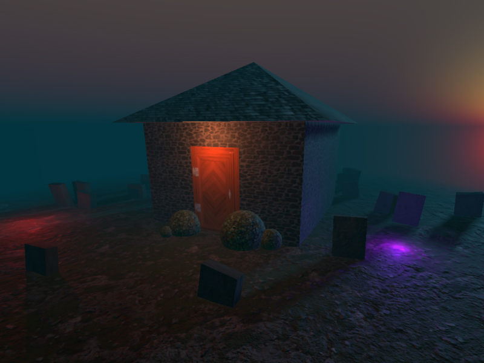

# threejs-haunted-house
Project to learn geometries, animations, lights, shadows...<br> 
[Demo link](https://qluback-haunted-house-3d.netlify.app/)



## Setup
Download [Node.js](https://nodejs.org/en/download/).
Run this followed commands:

``` bash
# Install dependencies (only the first time)
npm install

# Run the local server at localhost:8080
npm run dev

# Build for production in the dist/ directory
npm run build
```

Project followed with [ThreeJS Journey](https://threejs-journey.com/)
